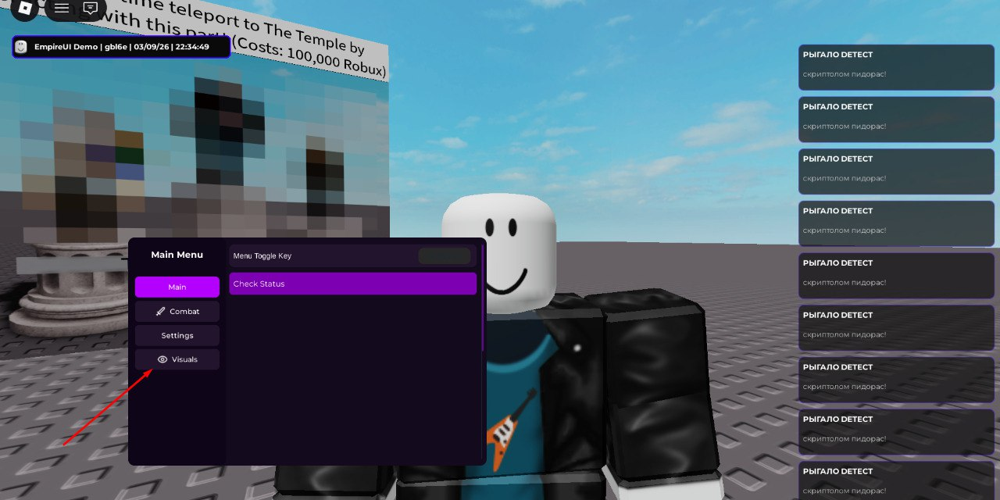

# 🌌 EmpireUI Library



## 🛠 Installation & Setup

To initialize the library, use the following loadstring:

```lua
local EmpireLib = loadstring(game:HttpGet("11111"))()
```
## DOCS 👀
[Click](https://github.com/Sqweex-lua/EmpireLib/blob/main/docs/docs.md)

## Demo

You can see demo [HERE](https://github.com/Sqweex-lua/EmpireLib/blob/main/src/demo.lua)

## Special Thanks to:

Icon Provider: [Footagesus Icons.](https://github.com/Footagesus/Icons)

Icon Sets: Lucide, Craft, Solar, and SF Symbols.


- - - - - - - - - - - - - - - - - -
 
Thank you for choosing EmpireUI. Build something amazing.
